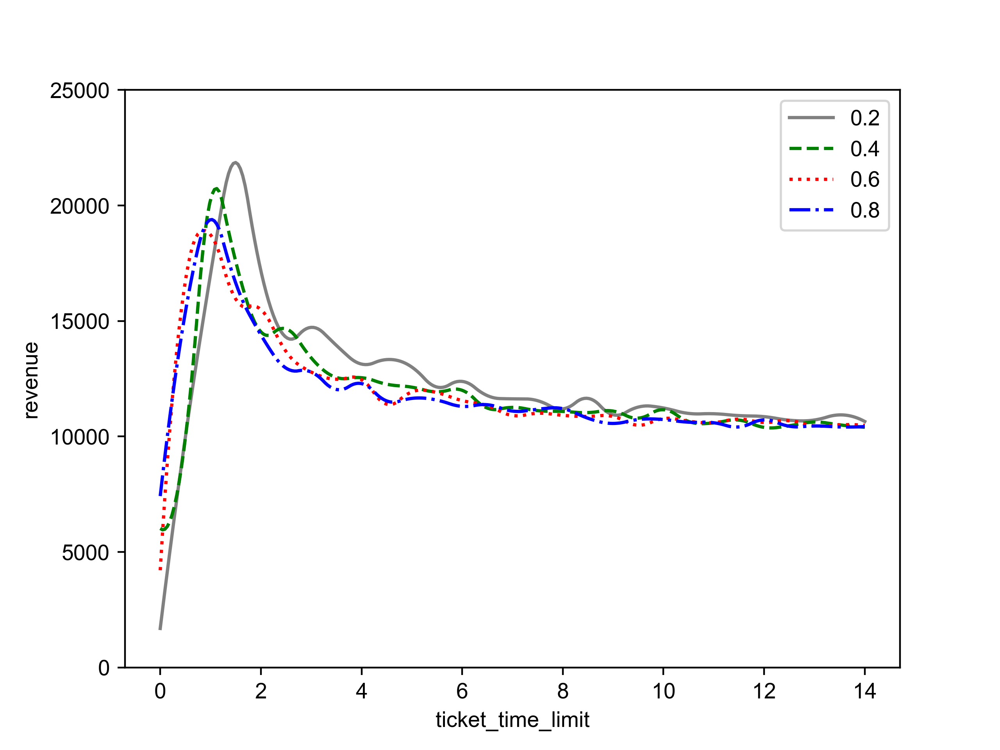

Process Graph

Result Graph

TODO:

~~1. add more points to graph to make more dense~~
~~2. in the same graph, have other trend lines of different lambda~~
~~3. change the increment in price from seatwise to weekwise (increment 5% per week) equal increment~~
~~4. median/meanline in each trend line~~